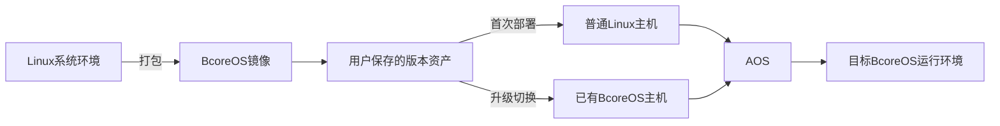

<a id="doc-top"></a>
# BcoreOS 🚀

> **BcoreOS不是替代Linux发行版，而是在Linux发行版之上提供系统版本管理、部署和生命周期管理能力。它提供一种基于系统镜像的Linux生命周期管理方式，将内核、驱动、系统库和应用程序整体打包为可部署镜像，实现Linux系统版本资产化。<br/>**
> **每一个镜像代表一个独立、完整的BcoreOS运行环境版本。该镜像既可用于普通Linux主机首次部署，也可用于已有BcoreOS主机升级或切换。不同版本之间无需继承关系，可独立生成、保存和复用**

---

##  🗺️ BcoreOS解决以下问题
1. **环境一致性**

- 将应用程序、依赖库、系统配置、驱动和内核整体封装为BcoreOS版本，开发、测试、生产使用同一个系统镜像。

2. **版本独立，无升级链依赖**

- 新的BcoreOS版本可以基于任意Linux发行版、内核和驱动环境制作，无需考虑目标主机当前运行的是哪个BcoreOS版本。

3. **系统版本切换**

- 目标主机默认仅运行当前BcoreOS版本，用户通过升级工具选择本地保存的目标镜像完成版本切换，不要求版本之间存在升级路径。
- 新版本可以基于完全不同的Linux发行版、内核和驱动环境制作。
- 用户可以选择任意目标BcoreOS版本，通过升级工具将已有BcoreOS主机切换到该版本。
- 切换过程中保持网络配置和非系统业务数据。

4. **批量升级**

- 已安装BcoreOS的主机可通过升级工具进行远程批量升级。
- 升级过程通过镜像差异分析，仅传输变化部分，实现快速版本切换。

5. **降低云环境快照成本**

- 云主机通常需要为每台实例保存独立系统快照。
- BcoreOS将系统环境转换为版本化镜像，
- 多台主机可以复用同一个BcoreOS版本镜像作为系统环境来源，需要变更系统环境时，通过升级工具选择目标版本进行切换，而无需为每台机器保存完整系统快照。

6. **完整Linux环境**

- 用户自由选择Linux内核、驱动和发行版，不依赖容器抽象硬件和系统环境，保留完整Linux系统能力。

7. **长期维护**

-  BcoreOS版本独立保存，几年后仍可以通过升级工具将主机切换到指定历史系统环境。

8. **远程安装**

- 无需依赖云厂商控制面板，通过SSH登录已有Linux机器即可安装BcoreOS。

9.  **系统环境自主可控**
- 将完整Linux运行环境封装为独立BcoreOS版本，
- 系统环境可本地保存、归档和迁移，不依赖在线软件仓库。

10. **版本资产独立**

- BcoreOS镜像独立保存于用户侧，
- 系统版本与具体设备生命周期解耦，
- 同一个版本镜像可以用于多台主机。
- BcoreOS镜像可以集中管理或离线保存，作为长期可复用的系统版本资产。

---
## 🔍BcoreOS实现原理
1. 为实现不同BcoreOS版本之间独立切换，并保持网络配置和非系统数据，BcoreOS设计了一个稳定的公共服务层AOS。
2. 系统启动时先启动AOS，AOS负责初始化网络、磁盘等基础环境，然后加载目标BcoreOS运行环境，AOS不承载用户业务环境，仅提供BcoreOS运行所需的基础管理能力。
3. 版本切换时，升级工具会同步目标BcoreOS及匹配的AOS环境，下一次启动由对应AOS负责启动目标BcoreOS运行环境。

### 🤝BcoreOS与AOS的关系
- **BcoreOS是用户对自己使用系统的二进制打包镜像，是核心**
- **AOS是为实现BcoreOS切换提供的交互层，是服务于BcoreOS的服务层**
### 🔄 BcoreOS工作流程



---

## BcoreOS镜像所有权

- BcoreOS镜像由用户自行制作和管理。

- BcoreOS项目不维护用户系统版本仓库，不收集用户系统镜像，也不要求用户上传系统版本。

- 每个BcoreOS镜像均属于用户自己的系统环境资产，用户可以离线保存、复制、部署和长期维护。

BcoreOS升级仅依赖：
- 升级工具能够访问目标设备
- 具备目标设备root权限
- 目标BcoreOS标记匹配

## ✨ BcoreOS核心功能
#### 💡 状态说明
* 🟢 **已实现**：完成开发，进入维护阶段。
* 🟡 **开发中**：部分开发，功能迭代中。
* 🔴 **设计中**：确定开发，在探讨方案中。
  
| 功能 |  子功能 / 特性| 实现程度 | 功能解释与技术细节 |
| :--- | :--- | :--- |:--- |
| **BcoreOS打包脚本** |对运行系统打包                    | 🟡 测试改进中  | 将当前运行Linux系统转换为可部署BcoreOS镜像（包含内核、驱动、库、应用程序） |
|                      |编辑BcoreOS包                    |  🔴 方案讨论中  | 对BcoreOS包进行编辑修改生成新包 |
| **安装脚本**        |云linux系统                       | 🟢               | 对于运行linux系统的云主机通过ssh安装自己打包的BcoreOS系统|
|                     |物理机Linux系统                   |  🟢               | 对于运行linux系统的本地物理机通过ssh安装自己打包的BcoreOS系统|
|                     |裸机安装                          | 🟢               | 对于没有安装系统的主机通过winpe或者liveCD安装自己打包的BcoreOS系统|
| **升级工具**        | x86 windows版本                  |  🟡 测试改进中  | 实现多机批量版本切换、镜像差异传输 |
|                      | x86 linux版本                    |  🟡 测试改进中  | 实现多机批量版本切换、镜像差异传输 |
|                      | arm linux版本                    |  🟡 测试改进中  | 实现多机批量版本切换、镜像差异传输 |
| **升级安全**        | 掉电安全                         |  🟢              | AOS使用双镜像实现升级过程掉电系统不出错，不失联 |
|                      | 缺驱动不失联                     |  🟢             | 升级采用试运行机制，新版本启动失败或硬件不兼容时自动回退原BcoreOS版本，避免远程设备失联 |
| **AOS系统管理**      | 有线网卡管理                    |  🟡 测试改进中   | 可使用工具管理AOS下的有线网卡，与BcoreOS的自动同步还在开发中 |
|                      | 无线网卡客户端                   |  🟡 测试改进中  | 可使用工具管理AOS下的无线网卡，与BcoreOS的自动同步还在开发中 |
|                      | 无ip通信                         |  🟡 测试改进中  | 主机无ip或者ip错误时，可在局域网中使用工具配置主机的ip地址 |
|                      | 磁盘管理                         |  🟡 测试改进中  | 磁盘使用zfs文件系统，阵列由zfs实现 |
| **系统特性**        | x86 uefi安全启动下加载自定义驱动  |  🟢             | 允许在开启uefi安全启动的电脑上启动,并加载自定义驱动 |
|                      | 擦除系统临时运行数据             |  🟡 测试改进中  | 使用overlay机制，当前仅在升级时擦除系统运行数据 |
|                      | 全盘加密                         |  🟢             | 制作BoreOS时设置的标记用于全盘密码，BcoreOS版本切换需要匹配的加密标记 |

---

## 💻 已适配系统<a id="supported-systems"></a>
#### 💡 状态说明
* 🟢 **适配完成**：已适配完成，进入维护阶段。
* 🟡 **正在适配**：正常适配测试。
* 🔴 **计划适配**：技术研究，方案探讨中。
  
| 系统 |  系统版本| 适配进度 | 内核版本 | 适配AOS最新版本 |
| :--- | :--- | :--- |:--- |:--- |
| **Rocky Linux** | [Rocky 10.1](https://dl.rockylinux.org/vault/rocky/10.1/isos/x86_64/Rocky-10.1-x86_64-dvd1.iso)  | 🟢 已适配完成  | 6.12.0-124.8.1 4070e7f10398bb2e4688ba1d9a877519  |[2026-8-21 发布首个版本](https://sourceforge.net/projects/bcoreos/files/AOS-img/rocky10.1_6.12.0-124.8.1_4070e7f10398bb2e4688ba1d9a877519/)|
|                   |Rocky 10.2  |  🔴 计划适配   | ||

---

## ⚡ 快速开始 <a id="quick-start"></a>
1. 准备系统母盘：[通用发行版](#generic-os-base)   [已有云服务系统](#cloud-os-clone)
2. 查看系统母盘的内核校验和，如：4070e7f10398bb2e4688ba1d9a877519
```
md5sum /boot/vmlinuz-$(uname -r)
```

3. 根据内核校验和下载对应的 [AOS](#supported-systems) ,如：aos-6.223.1067-202608201848-4070e7f10398bb2e4688ba1d9a877519-6.12.0-124.8.1.el10_1.x86_64-ext2-x86-64-vda.img.gz
4. 在母盘系统内创建aos目录并拷贝`BcoreOS_build.sh`和下载的`aos-*`到aos目录下;
5. 运行`BcoreOS_build.sh`脚本
```

[root@localhost aos]# chmod +x BcoreOS_build.sh
[root@localhost aos]# ./BcoreOS_build.sh
Available AOS versions for BcoreOS(/boot/vmlinuz-6.12.0-124.8.1.el10_1.x86_64):
1) /root/aos/aos-6.223.1067-202608201848-4070e7f10398bb2e4688ba1d9a877519-6.12.0-124.8.1.el10_1.x86_64-ext2-x86-64-vda.img.gz
2) AOS-6.223.1067_for_rocky10.1(6.12.0-124.8.1.el10_1.x86_64) (already downloaded at: /root/aos/aos-0EF9F4D281CB0F6F46C770F600BE732A)
3) AOS-6.222.2501_for_rocky10.1(6.12.0-124.8.1.el10_1.x86_64) (not downloaded yet)
4) AOS-6.222.2440_for_rocky10.1(6.12.0-124.8.1.el10_1.x86_64) (not downloaded yet)
Select [1-3] (default 1): 1
Download succeeded: /root/aos/aos-0EF9F4D281CB0F6F46C770F600BE732A
change BcoreOS tag (tags must match to allow update): BcoreOS
change output name: rocky10.1-20260821
Configuring system... done.
Config is:
    aosImg    : /root/aos/aos-6.223.1067-202608201848-4070e7f10398bb2e4688ba1d9a877519-6.12.0-124.8.1.el10_1.x86_64-ext2-x86-64-vda.img.gz
    BcoreOSTag: BcoreOS
    outputName: rocky10.1-20260821-6.223.1067

System will reboot to build BcoreOS. After the reboot is complete, the following files will be generated:
  - Pre-installation service package: /root/aos/rocky10.1-20260821-6.223.1067_AOS.img.gz
  - All-in-one Update package       : /root/aos/rocky10.1-20260821-6.223.1067_BcoreOS.upt
Press 'n' to cancel (8s)
```
6. 等待系统重启生成AOS(安装包)和BcoreOS(升级包)两个文件;

> [已有linux系统安装全新安装BcoreOS系统](#os-reinstall-fresh)

> [已安装BcoreOS系统的主机升级其他版本的BcoreOS系统](#os-system-upgrade)


### 📀 使用通用发行版制作系统母盘 <a id="generic-os-base"></a>
1. 下载linux发行版iso,如[rocky10.1](https://dl.rockylinux.org/vault/rocky/10.1/isos/x86_64/Rocky-10.1-x86_64-dvd1.iso)
2. 使用虚拟机或者物理机安装系统、驱动、应用程序
3. 使用`md5sum /boot/vmlinuz-$(uname -r)`查看安装好的系统的内核校验和在[已适配系统](#supported-systems)清单范围内，不在请联系我们适配

> 查看[快速开始](#quick-start)继续后续步骤

### ☁️ 使用已有云服务系统作为系统母盘<a id="cloud-os-clone"></a>
使用`md5sum /boot/vmlinuz-$(uname -r)`查看安装好的系统的内核校验和在[已适配系统](#supported-systems) 清单范围内，不在请联系我们适配
> 查看[快速开始](#quick-start)继续后续步骤

---
### 🧼 已有linux系统安装全新安装BcoreOS系统<a id="os-reinstall-fresh"></a>
1. 上传[快速开始](#quick-start)制作的AOS(安装包)和[aosinstall](#doc-top)脚本到目标机器
2. 运行`./aosinstall  ./rocky10.1-20260821-6.223.1067_AOS.img.gz`进行系统覆盖安装
```
[root@localhost aos]# chmod +x aosinstall
[root@localhost aos]# ./aosinstall ./rocky10.1-20260821-6.223.1067_AOS.img.gz
Install disk: /dev/nvme0n1
IP:           192.168.10.199/24
GateWay:      192.168.10.1
Memsize:      1929 M
Do you want continue(y/n):y
Start install ...
```
3. 执行完成后系统自动重启,重启后会继承原有ip地址,ssh登录信息:root/12345
> 参考 [已安装BcoreOS系统的主机升级其他版本的BcoreOS系统](#os-system-upgrade) 继续下一步

### 📈 已安装BcoreOS系统的主机升级其他版本的BcoreOS系统<a id="os-system-upgrade"></a>
#### 🔼 Windows下批量升级BcoreOS系统<a id="windows-system-upgrade"></a>

## 📄 开源协议

本项目基于 GNU Affero General Public License v3.0（AGPL-3.0） 协议开源。任何个人或组织均可在遵守 AGPL-3.0 许可证条款的前提下使用本项目。
